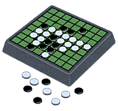
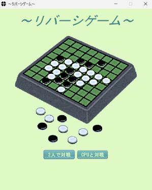
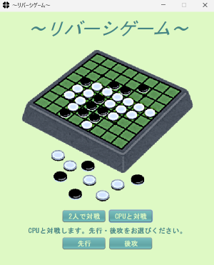
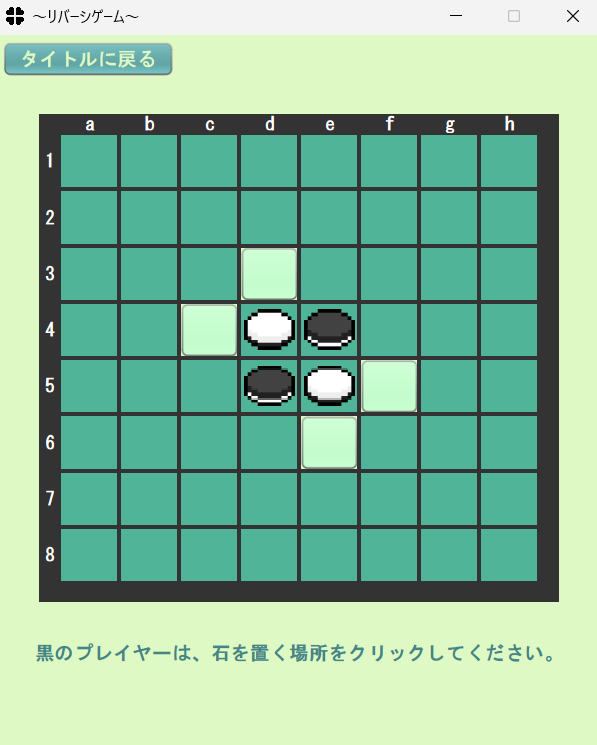
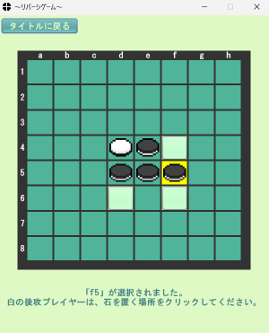
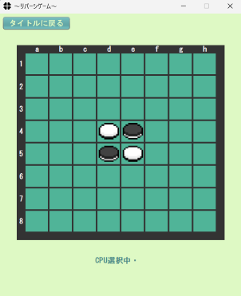
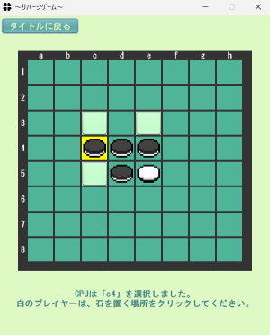
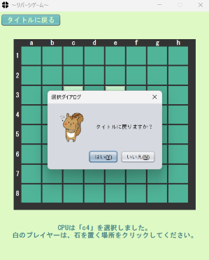
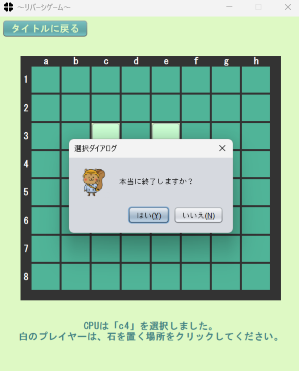

# リバーシゲームアプリ

# 目次

1.アプリ概要

2.アプリ作成の理由

3.使用技術

4.アプリイメージ

5.ER図

6.工夫した点

7.今後のアップデートについて

8.使用した画像の出典サイト

# 1.アプリ概要
GUI操作が可能なリバーシアプリです。

2人で対戦モードとCPUと対戦モードの2つの楽しみ方があります。

# 2.アプリ作成の理由
・Javaの学習がひと段落ついたため、学びのアウトプットとして作成しました。

・リバーシがもともと好きであり、またゴールイメージが比較的明確と考えたため作成対象として選びました。

# 3.使用技術
・Java

(JavaのGUIに関するライブラリのSwingを使用しているため、Javaのみで作成することができました)

# 4.アプリイメージ
## スタート画面
　

2人で対戦を選んだ場合は、そのままプレイ画面へ遷移します。

CPUと対戦を選んだ場合は、プレイヤーが先攻・後攻を選択できる仕様になっています。

## 「2人で対戦」プレイ画面
 

プレイヤーが選択できる場所を白いボタンで表しています。

また、相手が直前に選択した場所の背景を黄色にしています。

## 「CPUと対戦」プレイ画面
 

CPUが選択を行うアルゴリズムについて、現時点では高度なものは実装しておりません。

## 「タイトルに戻る」ボタン押下時の処理

左上の「タイトルに戻る」ボタンを押下した際に、確認画面を表示します。

## 右上×ボタン押下時の処理

ウインドウ右上の×ボタンを押下した際に、確認画面を表示します。

# 5.ER図

現在準備中です。恐れ入ります。

# 6.工夫した点
・画面の表示を担当するクラスやゲームの進行を担当するクラスなどのように、

　それぞれのクラスの責務を明確にしたうえでオブジェクト指向プログラミングを行った点。

・クラス化やメソッド化をできるだけ行い、長すぎて読みづらい記述にならないよう注意した点。

・変数名やメソッド名について、見ただけで内容が分かるように定義した点。

　(例：totalTurnCount変数(全ゲームのターン数を保持する変数)、

　　   checkInputablePlaceメソッド(盤面の入力可能な場所を確認するメソッド))

・長くプレイできるように、目に優しい緑色を基調として配色を選んだ点。

・タイトルに戻るボタンやウィンドウ×ボタン押下時に確認画面を表示し、
　
 意図せず進行状況が失われてしまうことを防ぐよう設計した点。

# 7.今後のアップデートについて
以下の機能を追加したいと考えています。

・一手前に戻る機能

・プレイ履歴を確認できる機能

・選択した手がリバーシの定石に該当する場合、その定石名を表示する機能

・CPUの強さを設定できる機能

# 8.使用した画像の出典サイト
・いらすとや

・DOT　ILLUST

・てがきっず

(全て商用・非商用問わず2次利用が可能であるものを使用しています)
